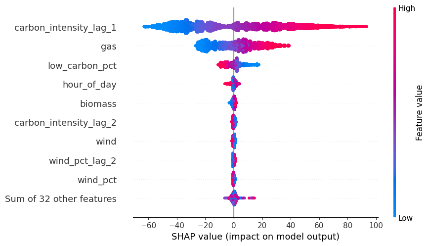
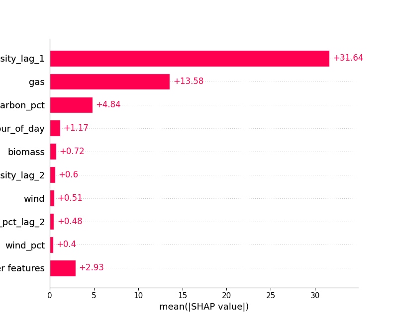

# EV Charging Demand Optimisation

Forecast grid carbon intensity and EV charging demand, then optimise charge schedules to minimise carbon emissions and cost. Built as a deliberately over-engineered local MVP — the architecture mirrors what a production system at Kaluza/Flex scale would look like, even though a single laptop is enough to run it.

> **Cloud-native version:** see [`EV_Charging_Cloud_Native_Architecture_Brief.md`](./EV_Charging_Cloud_Native_Architecture_Brief.md) for the full UpCloud + GCP design with Kafka, BigQuery, Cloud Run, and Dataflow.

---

## What this repo is

A **local-only ML MVP** that runs end-to-end on a single machine:

1. Pulls live grid and weather data from public APIs
2. Validates and engineers features into 30-minute settlement period windows
3. Trains LightGBM quantile models (P10/P50/P90) to forecast carbon intensity
4. Models EV session behaviour using a Gaussian Mixture Model
5. Optimises individual charging schedules with linear programming
6. Exposes everything through a local FastAPI

The production cloud version replaces Parquet files with BigQuery, the local scheduler with Cloud Scheduler, and the FastAPI with Cloud Run microservices — but the ML logic, feature pipeline, and LP formulation are identical.

---

## Stack

| Layer | Technology |
|---|---|
| Language | Python 3.11+ managed with `uv` |
| Data collection | `httpx` — Carbon Intensity API, Open-Meteo, ACN-Data |
| Storage | Parquet (local), `pyarrow` |
| Feature engineering | `pandas`, `numpy` |
| ML forecasting | `lightgbm` (quantile regression), `shap` |
| EV behaviour model | `scikit-learn` GaussianMixture |
| Optimiser | `PuLP` / `scipy` (linear programming) |
| API | `FastAPI` + `uvicorn` |
| Testing | `pytest`, `httpx` mock transport |

---

## Project structure

```
energy-forecasting/
├── src/
│   ├── data/
│   │   ├── collectors/                    # API clients: carbon intensity, generation mix, weather, EV sessions
│   │   ├── validators/                    # Schema and range validation for each data source
│   │   └── run_data_collection_pipeline.py  # Fetch all sources into DuckDB in chunked API calls
│   ├── features/                          # Feature engineering pipeline
│   │   ├── alignment.py                   # Align all sources to 30-min settlement periods
│   │   ├── weather_join.py                # Interpolate weather onto the grid index
│   │   ├── rolling.py                     # 7-day rolling averages
│   │   ├── lags.py                        # Lag features (t-1, t-2, t-48, t-336)
│   │   ├── calendar_features.py           # Hour, day-of-week, bank holidays, season sin/cos
│   │   ├── penetration.py                 # Wind/solar penetration %
│   │   ├── run_feature_pipeline.py        # Load from DuckDB → engineer features → save Parquet
│   │   └── store.py                       # Read/write feature Parquet files
│   ├── models/
│   │   ├── forecasting/                   # LightGBM quantile trainer, CV, metrics, SHAP, artefacts
│   │   │   ├── trainer.py                 # train_quantile_lgbm: time-series CV + MLflow tracking
│   │   │   ├── run_training_pipeline.py   # Load features → train P10/P50/P90 → log to MLflow
│   │   │   ├── cv.py                      # TimeSeriesSplit with gap
│   │   │   ├── metrics.py                 # Pinball loss
│   │   │   └── baselines.py               # Persistence and seasonal naive baselines
│   │   └── ev_behaviour/                  # GMM session model
│   ├── optimiser/                         # LP charge scheduler
│   ├── api/                               # FastAPI app and endpoint schemas
│   └── logging_config.py                  # Structured JSON logging
├── tests/                                 # Mirrors src/ structure, all HTTP mocked
├── data/
│   ├── raw/                               # Downloaded Parquet files by source
│   └── features/                          # Feature store output (features_YYYY-MM-DD.parquet)
└── saved_models/                          # Versioned model artefacts by date (YYYY-MM-DD/)
```

---

## Epics

| Epic | Status | Description |
|---|---|---|
| 0 — Project Setup | ✅ Complete | Scaffold, dependencies, logging, test fixtures |
| 1 — Data Acquisition | ✅ Complete | API clients, retry logic, incremental fetch, raw Parquet save |
| 2 — Data Validation | ✅ Complete | Schema checks, range validation, validation report |
| 3 — Feature Engineering | ✅ Complete | Full pipeline: alignment → weather → rolling → lags → calendar |
| 4 — Model Selection | ✅ Complete | Empirical comparison of Decision Tree, Random Forest, LightGBM — see `notebooks/model_selection.ipynb` |
| 5 — ML Model Training | 🔨 In progress | Time-series CV, LightGBM quantile, baselines, SHAP, artefacts |
| 6 — EV Behaviour Model | ⏳ Pending | GMM fit on ACN session data, session sampler |
| 7 — Charging Optimiser | ⏳ Pending | LP formulation, carbon/cost saving vs dumb charging baseline |
| 8 — Local Forecast API | ⏳ Pending | FastAPI wrapping the trained models and optimiser |

---

## Development method

This project was started to allow me to apply my ML skills to energy related problems specifically. All ML code is built by me, but the set up of other parts of the pipeline such as the data collection and feature engineering is built using **Ralph Loops** — an autonomous multi-agent development pattern where an AI agent reads a PRD, implements one task at a time, runs tests, commits, and iterates until the PRD is complete. Getting LLMs to build much of the data pipeline has allowed me to focus much more on the ML training and optimisation work, which is the core of this project.

I plan to make this project locally first, then move to the production cloud version when I have time.


### Ralph Loop development workflow

Each task follows this flow:

```
prd.json (task spec)
    │
    ▼
Feature branch created
    │
    ├── CODER (Claude or Gemini, randomly assigned)
    │     implements in atomic commits:
    │     [task-id] title: implement
    │     [task-id] title: add tests
    │     [task-id] title: mark complete
    │
    ▼
PR opened on GitHub
    │
    ├── REVIEWER (the other AI)
    │     reads gh pr diff, posts review comment
    │     ends with APPROVED or CHANGES REQUESTED
    │
    ▼
Auto-merged → main
```

All ml tasks (Epics 4–6 ) were marked 'owner' as 'human' in `prd.json` so the loop would stop when it reached them and allow me to carry out the coding and optimisation work.

For all other tasks, Claude and Gemini are randomly assigned coder/reviewer roles per task, so each PR has a cross-model review. The human developer (James) owns (the ML and optimisation work) — those tasks are marked `"owner": "human"` in `prd.json` and the loop stops automatically when it reaches them.

To run the loop:

```bash
./ralph-loop.sh --max 10
```

To run a single iteration:

```bash
./ralph-once.sh
# or force a specific task:
./ralph-once.sh --task 1.4
```

---

## Quickstart

```bash
cd energy-forecasting
uv sync                          # install dependencies
uv run pytest tests/ -v          # run all tests (~60 passing)
```

To run the full pipeline:

```bash
# 1. Fetch raw data into DuckDB (carbon intensity, generation mix, weather)
uv run python -m src.data.run_data_collection_pipeline

# 2. Engineer features and save to Parquet
uv run python src/features/run_feature_pipeline.py

# 3. Train P10/P50/P90 LightGBM models (results tracked in MLflow)
uv run python src/models/forecasting/run_training_pipeline.py

# View MLflow experiment results
uv run mlflow ui
```

To fetch live data for a custom date range:

```bash
uv run python -c "
from src.data.collectors.carbon_intensity import fetch_carbon_intensity
from datetime import datetime, timedelta, timezone
end = datetime.now(timezone.utc)
start = end - timedelta(days=7)
df = fetch_carbon_intensity(start, end)
print(df.head())
"
```

---

## Interesting notes about this project

- **Quantile regression over point estimates:** instead of forecasting the median, the P10/P50/P90 forecasts give uncertainty bounds which is standard in energy dispatch where knowing the range matters as much as the median.
- **Linear Programming (LP) over Reinforcement Learning (RL)**: the single-vehicle charge scheduling problem has known constraints and a fixed horizon. LP is exact, fast, and fully interpretable. RL would only become relevant at fleet scale with live grid feedback.
- **Time-series CV:** random CV would leak future data into training. TimeSeriesSplit with a 48-period gap (1 day) ensures validation always follows training chronologically.
- **DuckDB vs PySpark (cloud version):** at this data volume DuckDB is faster and simpler; the architecture isolates that choice to one service, so swapping Dataproc in at scale changes nothing else.
- **Ralph Loops + multi-agent review:** autonomous AI-driven development with cross-model code review (Claude ↔ Gemini) reflects where engineering practice is heading — and produced 20+ reviewed PRs with atomic commits.

#### Notes about the features chosen

How do you know which features to engineer? Firstly before touching data, ask: what would a human expert use to make this prediction?

For carbon intensity, an energy trader would tell you:
 - Is it windy? (wind displaces gas)
 - What time of day? (demand peaks at 6pm)
 - Is it a weekday? (industrial demand)
 - What happened yesterday at this time? (patterns repeat strongly day-to-day)
 - What season is it? (seasonal weather patterns)


 That reasoning directly maps to wind_pct, hour_of_day, is_weekend, lag_48 and season is reflected in month (1-12) which is a bit blunt, or day of the year (1-365)
 
 We would expect to see the following patterns and effects in the UK:
   - Winter: less solar, more gas/coal to meet heating demand → higher carbon intensity                                        
  - Summer: more solar, lower demand → lower carbon intensity                                                                 
  - Spring/Autumn: wind tends to be higher in the UK  

  Even better than day of the year is a sine/cosine encoding of the season:                                                                        
                                                                                                                              
  `df['season_sin'] = np.sin(2 * np.pi * df['day_of_year'] / 365)`
  `df['season_cos'] = np.cos(2 * np.pi * df['day_of_year'] / 365)`

  This wraps the year into a circle so the model understands December and January are adjacent, not opposites. This is like the first harmonic of a Fourier transform.


  # Notes on the SHAP analysis

  SHAP values help us explain the model's predictions by showing how important each feature was in the prediction. Specifically the plots show how much each feature has either increased or decreased the predicted value.  

  

- Shows clearly that carbon_intensity_lag_1 is by far biggest driver of P50 predictions 

      


- Shows  that gas is second biggest driver of P50 predictions, but far behind, 13.58 vs 31.64