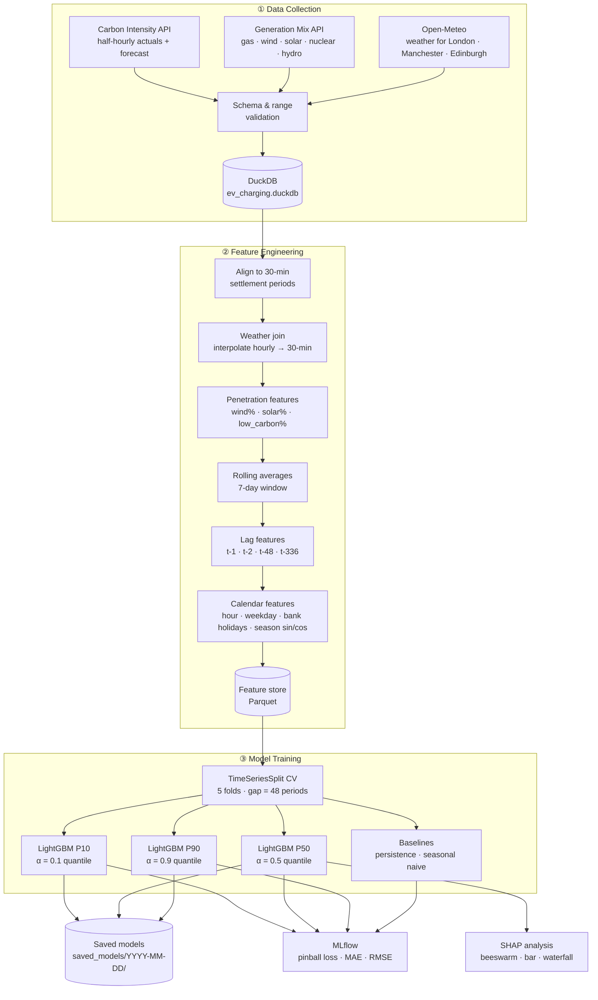

# EV Charging Demand Optimisation

[](https://github.com/james-westwood/EV-Charging-Demand-Optimisation/actions/workflows/ci.yml)
[](https://github.com/astral-sh/ruff)
[](https://github.com/astral-sh/ty)
[](https://opensource.org/licenses/MIT)
[](https://www.python.org/)

Forecast grid carbon intensity and EV charging demand, then optimise charge schedules to minimise carbon emissions and cost. The project exists in two forms: a **local version** running end-to-end on a single machine, and a **cloud version** built on Databricks with PySpark, Delta tables, and the MLflow Model Registry.

> **Cloud-native architecture brief:** see [`EV_Charging_Cloud_Native_Architecture_Brief.md`](./EV_Charging_Cloud_Native_Architecture_Brief.md) for the full UpCloud + GCP design with Kafka, BigQuery, Cloud Run, and Dataflow.

---

## Sustainable Development Goals

This project directly supports two UN Sustainable Development Goals:

| Goal | Link |
|---|---|
| **SDG 7 — Affordable and Clean Energy**: optimising when EVs charge to maximise use of low-carbon grid electricity | [sdgdata.gov.uk/7](https://sdgdata.gov.uk/7/) |
| **SDG 13 — Climate Action**: reducing carbon emissions from EV charging through carbon-aware scheduling | [sdgdata.gov.uk/13](https://sdgdata.gov.uk/13/) |

---

## What this repo is

An end-to-end ML pipeline in two versions:

1. Pulls live grid and weather data from public APIs
2. Validates and engineers features into 30-minute settlement period windows
3. Trains LightGBM quantile models (P10/P50/P90) to forecast carbon intensity
4. Models EV session behaviour using a Gaussian Mixture Model
5. Optimises individual charging schedules with linear programming
6. Exposes everything through a FastAPI

### Local version vs Databricks version

The local version runs on a single machine using pandas and DuckDB. The Databricks version mirrors the same pipeline at scale using PySpark, Delta tables, and the MLflow Model Registry:

| Local (`src/`) | Databricks |
|---|---|
| `collectors/carbon_intensity.py` | Bronze table — raw API data ingested to Delta |
| `features/rolling.py`, `lags.py` | Silver table — PySpark window functions replacing pandas |
| `features/store.py` | Gold table — ML-ready feature table |
| `models/trainer.py` | `applyInPandas` — train per region in parallel |
| `models/artefacts.py` | MLflow Model Registry |

The ML logic, feature pipeline, and LP formulation are identical across both versions.

---

## Local pipeline



---

## Stack

| Layer | Technology |
|---|---|
| Language | Python 3.11+ managed with `uv` |
| Data collection | `httpx`: Carbon Intensity API, Open-Meteo, ACN-Data |
| Storage | `duckdb` (raw + features), Parquet export via `pyarrow` |
| Feature engineering | `pandas`, `numpy` |
| ML forecasting | `lightgbm` (quantile regression), `shap` |
| EV behaviour model | `scikit-learn` GaussianMixture |
| Visualisation | `matplotlib`, `seaborn`, `plotly` |
| Portfolio dashboard | `streamlit` |
| System diagrams | `diagrams` (cloud architecture, PNG), Mermaid (pipeline flows, GitHub-native) |
| Streaming | Apache Kafka (self-hosted on UpCloud) |
| Cloud | GCP: BigQuery, Cloud Run, Dataflow, GCS, Cloud Scheduler, Secret Manager |
| Scale-up (Databricks track) | PySpark, Delta tables, `applyInPandas` for regional model training |
| Testing | `pytest`, `httpx` mock transport |

---

## Project structure

```
energy-forecasting/
├── src/
│   ├── data/
│   │   ├── collectors/                    # API clients: carbon intensity, generation mix, weather, EV sessions
│   │   ├── validators/                    # Schema and range validation for each data source
│   │   └── run_data_collection_pipeline.py  # Fetch all sources into DuckDB in chunked API calls
│   ├── features/                          # Feature engineering pipeline
│   │   ├── alignment.py                   # Align all sources to 30-min settlement periods
│   │   ├── weather_join.py                # Interpolate weather onto the grid index
│   │   ├── rolling.py                     # 7-day rolling averages
│   │   ├── lags.py                        # Lag features (t-1, t-2, t-48, t-336)
│   │   ├── calendar_features.py           # Hour, day-of-week, bank holidays, season sin/cos
│   │   ├── penetration.py                 # Wind/solar penetration %
│   │   ├── run_feature_pipeline.py        # Load from DuckDB → engineer features → save Parquet
│   │   └── store.py                       # Read/write feature Parquet files
│   ├── models/
│   │   ├── forecasting/                   # LightGBM quantile trainer, CV, metrics, SHAP, artefacts
│   │   │   ├── trainer.py                 # train_quantile_lgbm: time-series CV + MLflow tracking
│   │   │   ├── run_training_pipeline.py   # Load features → train P10/P50/P90 → log to MLflow
│   │   │   ├── cv.py                      # TimeSeriesSplit with gap
│   │   │   ├── metrics.py                 # Pinball loss
│   │   │   └── baselines.py               # Persistence and seasonal naive baselines
│   │   └── ev_behaviour/                  # GMM session model
│   ├── optimiser/                         # LP charge scheduler
│   ├── api/                               # FastAPI app and endpoint schemas
│   └── logging_config.py                  # Structured JSON logging
├── tests/                                 # Mirrors src/ structure, all HTTP mocked
├── data/
│   ├── raw/                               # Downloaded Parquet files by source
│   └── features/                          # Feature store output (features_YYYY-MM-DD.parquet)
└── saved_models/                          # Versioned model artefacts by date (YYYY-MM-DD/)
```

---

## Roadmap

The project runs as two parallel tracks: a **local pipeline** for rapid ML iteration, and a **cloud/Kafka track** that shows how the same system would run at production scale.

### Local pipeline track

| Epic | Status | Description |
|---|---|---|
| 0. Project Setup | Complete | Scaffold, dependencies, logging, test fixtures |
| 1. Data Acquisition | Complete | API clients, retry logic, incremental fetch, raw Parquet save |
| 2. Data Validation | Complete | Schema checks, range validation, validation report |
| 3. Feature Engineering | Complete | Full pipeline: alignment, weather, rolling, lags, calendar |
| 4. Model Selection | Complete | Empirical comparison of Decision Tree, Random Forest, LightGBM; see `notebooks/model_selection.ipynb` |
| 5. ML Model Training | In progress | See breakdown below |
| 6. EV Behaviour Model | Pending | GMM fit on ACN session data, session sampler |
| 7. Charging Optimiser | Pending | LP formulation, carbon/cost saving vs dumb charging baseline |
| 8. Local Forecast API | Pending | FastAPI wrapping the trained models and optimiser |
| 10. Portfolio Dashboard | Pending | Streamlit app surfacing all graphics, forecasts, and optimiser results |

### Cloud + Kafka track

| Epic | Status | Description |
|---|---|---|
| DB-1. Databricks exploration | In progress | Bronze/Silver/Gold Delta tables, 14 regional LightGBM models via `applyInPandas`; see breakdown below |
| DB-2. Regional weather features | Pending | Add weather (wind speed, solar irradiance) to Databricks Silver/Gold — key gap for Wales/South West models |
| 9. Cloud Deployment | Pending | UpCloud Kafka VM → GCP: Dataflow, BigQuery, Cloud Run microservices; see `EV_Charging_Cloud_Native_Architecture_Brief.md` |

> **Full cloud architecture:** see [`EV_Charging_Cloud_Native_Architecture_Brief.md`](./EV_Charging_Cloud_Native_Architecture_Brief.md) for the Kafka PRDs, GCP service breakdown, cost estimate, and parallelisation plan.

### System diagrams

| Task | Status |
|---|---|
| Local pipeline flow diagram (Mermaid — renders in README) | To do |
| Cloud architecture diagram (`diagrams` Python package — PNG with GCP/Kafka logos) | To do |
| Databricks Bronze/Silver/Gold data flow diagram | To do |

### Epic DB-1 — Databricks exploration detail

| Task | Status |
|---|---|
| `01_bronze_carbon_intensity_regional` — fetch 14 UK regions × 336 half-hour periods from National Grid ESO API to Delta | Done |
| `02_silver_carbon_intensity_regional` — clean, validate, flag nulls, write to Silver Delta table | Done |
| `03_gold_carbon_intensity_regional` — rolling avg, lag features (t-1, t-2, t-48, t-336), write to Gold Delta table | Done |
| `04_train_regional_models` — `applyInPandas` to train P10/P50/P90 LightGBM per region (14 regions × 3 alphas × 5 folds = 252 fits) | Done |
| **DB-1.5** Add `fetch_regional_weather()` to `src/data/collectors/weather.py` — lat/lon for all 14 DNO regions, matching region IDs in carbon intensity data | To do |
| **DB-1.6** `05_bronze_weather_regional` notebook — call `fetch_regional_weather()` via `sys.path` import, write to `bronze_weather_regional` Delta table | To do |
| **DB-1.7** Commit existing Databricks notebooks (`01`–`04`) to `notebooks/databricks/` so they're visible on GitHub — add folder `README.md` explaining the medallion structure | To do |
| **DB-1.8** Update README Databricks section — dedicated Bronze→Silver→Gold→Models Mermaid diagram | To do |
| **DB-1.9** Update portfolio `PLAN.md` — add Databricks as a dedicated showcase block on the EV project page (what to screenshot, what to write up) | To do |
| Add weather features to Silver/Gold and retrain regional models | To do |
| Compare GB single model vs regional models on same test set | To do |
| Log summary metrics to MLflow from the Databricks driver | To do |
| **Viz:** pinball loss by region — barh chart comparing all 14 regions | To do |

### Epic 9 — Cloud Deployment detail (Kafka-first)

Kafka is the contract boundary between all microservices. It must exist before any cloud service is built. See [`EV_Charging_Cloud_Native_Architecture_Brief.md`](./EV_Charging_Cloud_Native_Architecture_Brief.md) for full PRDs.

| Phase | Task | Status |
|---|---|---|
| 9.1 | UpCloud VM: Ubuntu 24.04, Kafka 3.7, SASL/SSL, 6 topics provisioned | To do |
| 9.2 | GCP infrastructure: BigQuery, Cloud Run, GCS, Dataflow, Secret Manager (Terraform) | To do |
| 9.3 | Go Grid Data Ingestor — polls APIs, publishes to Kafka every 30 min | To do |
| 9.4 | Dataflow Kafka→BigQuery pipeline for 3 topics | To do |
| 9.5 | Python Feature Engineering consumer — Kafka → DuckDB → BigQuery | To do |
| 9.6 | Python ML Forecasting service — BigQuery → LightGBM → `/forecast` endpoint | To do |
| 9.7 | Go Charging Optimiser — Kafka consumer, LP solve, publishes to `charging.schedules.optimised` | To do |
| 9.8 | Streamlit Dashboard on Cloud Run | To do |

### Epic 5 — ML Model Training detail

| Task | Status |
|---|---|
| Time-series walk-forward CV (`cv.py`) | Done |
| Pinball loss metric (`metrics.py`) | Done |
| Persistence + seasonal naive baselines (`baselines.py`) | Done |
| LightGBM quantile trainer P10/P50/P90 (`trainer.py`) | Done |
| Training pipeline with MLflow tracking (`run_training_pipeline.py`) | Done |
| SHAP analysis: beeswarm + bar plots (`shap_analysis.py`) | Done |
| Quantile monotonicity check (P10 <= P50 <= P90) | Done |
| Evaluate P10/P50/P90 vs baselines using pinball loss | Done |
| Save model artefacts to `saved_models/YYYY-MM-DD/` | Done |
| Load latest model artefacts | Done |
| **Viz:** Forecast uncertainty bands — actuals overlaid on shaded P10/P50/P90 | To do |
| **Viz:** Pinball loss comparison bar chart — LightGBM vs persistence vs seasonal naive | To do |
| **Viz:** Quantile calibration plot — % actuals captured within P10–P90 band | To do |
| **Viz:** SHAP waterfall plots — per-prediction explainability ("why high carbon at 6pm Friday?") | To do |

### Epic 6 — EV Behaviour Model detail

| Task | Status |
|---|---|
| Load and clean ACN session data | To do |
| Fit Gaussian Mixture Model on arrival time + energy draw | To do |
| Session sampler from fitted GMM | To do |
| **Viz:** Charging session arrival heatmap — hour-of-day × day-of-week intensity | To do |
| **Viz:** Energy draw distribution — GMM components overlaid on ACN histogram | To do |

### Epic 7 — Charging Optimiser detail

| Task | Status |
|---|---|
| LP formulation: minimise carbon cost over charging horizon | To do |
| Integrate P10/P50/P90 forecasts as carbon signal | To do |
| Constraint handling: session window, battery capacity, grid limits | To do |
| Carbon/cost saving vs dumb (immediate full charge) baseline | To do |
| **Viz:** Carbon-optimal charging window heatmap — hour × weekday, colour = median predicted carbon intensity | To do |
| **Viz:** Carbon savings chart — optimised vs dumb charging, cumulative over time | To do |

### Epic 8 — Local Forecast API detail

| Task | Status |
|---|---|
| FastAPI app scaffold with health endpoint | To do |
| `/forecast` endpoint — return P10/P50/P90 for next N periods | To do |
| `/optimise` endpoint — return optimal charge schedule for a session | To do |
| Regional carbon intensity data collection (Carbon Intensity API regional endpoint) | To do |
| **Viz:** UK regional carbon intensity map — Plotly choropleth of GB regions, colour = live/forecast carbon | To do |
| **Viz:** Generation mix stacked area chart — gas/wind/nuclear/solar/hydro over time, animated or interactive | To do |

### Epic 10 — Portfolio Dashboard detail

| Task | Status |
|---|---|
| Streamlit app scaffold with sidebar navigation | To do |
| Forecast page — live P10/P50/P90 bands chart with recent actuals | To do |
| Grid page — generation mix stacked area + UK regional carbon map | To do |
| EV demand page — session arrival heatmap + energy draw distribution | To do |
| Optimiser page — charging window heatmap + carbon savings comparison | To do |
| Model explainability page — SHAP beeswarm, bar, waterfall | To do |
| Deploy dashboard (Streamlit Cloud or HuggingFace Spaces) | To do |

---

## Development method

This project was started to allow me to apply my ML skills to energy related problems specifically. All ML code is built by me, but the set up of other parts of the pipeline such as the data collection and feature engineering is built using **Ralph Loops**, an autonomous multi-agent development pattern where an AI agent reads a PRD, implements one task at a time, runs tests, commits, and iterates until the PRD is complete. Getting LLMs to build much of the data pipeline has allowed me to focus much more on the ML training and optimisation work, which is the core of this project.

The local version is the primary development environment. The Databricks version is being built in parallel as a cloud-scale implementation of the same pipeline.


---

## Quickstart

```bash
cd energy-forecasting
uv sync                          # install dependencies
uv run pytest tests/ -v          # run all tests (~199 passing)
```

To run the full pipeline:

```bash
# 1. Fetch raw data into DuckDB (carbon intensity, generation mix, weather)
uv run python -m src.data.run_data_collection_pipeline

# 2. Engineer features and save to Parquet
uv run python src/features/run_feature_pipeline.py

# 3. Train P10/P50/P90 LightGBM models (results tracked in MLflow)
uv run python src/models/forecasting/run_training_pipeline.py

# View MLflow experiment results
uv run mlflow ui
```

To fetch live data for a custom date range:

```bash
uv run python -c "
from src.data.collectors.carbon_intensity import fetch_carbon_intensity
from datetime import datetime, timedelta, timezone
end = datetime.now(timezone.utc)
start = end - timedelta(days=7)
df = fetch_carbon_intensity(start, end)
print(df.head())
"
```

---

## Interesting notes about this project

- **Quantile regression over point estimates:** instead of forecasting the median, the P10/P50/P90 forecasts give uncertainty bounds which is standard in energy dispatch where knowing the range matters as much as the median.
- **Linear Programming (LP) over Reinforcement Learning (RL)**: the single-vehicle charge scheduling problem has known constraints and a fixed horizon. LP is exact, fast, and fully interpretable. RL would only become relevant at fleet scale with live grid feedback.
- **Time-series CV:** random CV would leak future data into training. TimeSeriesSplit with a 48-period gap (1 day) ensures validation always follows training chronologically.
- **DuckDB vs PySpark (cloud version):** at this data volume DuckDB is faster and simpler; the architecture isolates that choice to one service, so swapping Dataproc in at scale changes nothing else.
- **Ralph Loops + multi-agent review:** autonomous AI-driven development with cross-model code review (Claude ↔ Gemini) reflects where engineering practice is heading, producing 20+ reviewed PRs with atomic commits.

#### Notes about the features chosen

How do you know which features to engineer? Firstly before touching data, ask: what would a human expert use to make this prediction?

For carbon intensity, an energy trader would tell you:
 - Is it windy? (wind displaces gas)
 - What time of day? (demand peaks at 6pm)
 - Is it a weekday? (industrial demand)
 - What happened yesterday at this time? (patterns repeat strongly day-to-day)
 - What season is it? (seasonal weather patterns)


 That reasoning directly maps to wind_pct, hour_of_day, is_weekend, lag_48 and season is reflected in month (1-12) which is a bit blunt, or day of the year (1-365)
 
 We would expect to see the following patterns and effects in the UK:
   - Winter: less solar, more gas/coal to meet heating demand → higher carbon intensity                                        
  - Summer: more solar, lower demand → lower carbon intensity                                                                 
  - Spring/Autumn: wind tends to be higher in the UK  

  Even better than day of the year is a sine/cosine encoding of the season:                                                                        
                                                                                                                              
  `df['season_sin'] = np.sin(2 * np.pi * df['day_of_year'] / 365)`
  `df['season_cos'] = np.cos(2 * np.pi * df['day_of_year'] / 365)`

  This wraps the year into a circle so the model understands December and January are adjacent, not opposites. This is like the first harmonic of a Fourier transform.


#### Notes on the SHAP analysis

  SHAP values help us explain the model's predictions by showing how important each feature was in the prediction. Specifically the plots show how much each feature has either increased or decreased the predicted value.  

  

- Shows clearly that carbon_intensity_lag_1 is by far biggest driver of P50 predictions 

      


- Shows  that gas is second biggest driver of P50 predictions, but far behind, 13.58 vs 31.64